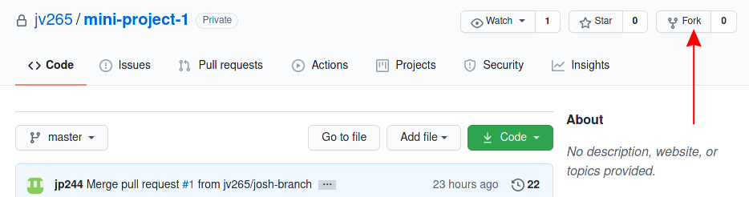

# Repository:
A Git Repository contains all commit objects and their references. A repository is stored within a project, in a subdirectory, named `.git`.
### Example
```bash
 $ git init my_project
 $ ls -1 .git/
	 branches
	 config
	 description
	 HEAD
	 hooks
	 info
	 objects
	 refs
```

# Clone:
A Git Clone will use an existing repository and create a clone (copy) of the target respository on your local machine.
### Example
```bash
 $ git clone https://github.com/kaw393939/IS601-Fall2020
	 Cloning into 'IS601-Fall2020'...
	 remote: Enumerating objects: 32, done.
	 remote: Counting objects: 100% (32/32), done.
	 remote: Compressing objects: 100% (25/25), done.
	 Receiving objects: 100% (32/32), 7.57 KiB | 7.57 MiB/s, done.
	 remote: Total 32 (delta 7), reused 8 (delta 1), pack-reused 0
	 Resolving deltas: 100% (7/7), done.
```


# Fork:
Forking a Git repository will allow a developer to duplicate an existing repository into their own personal account. This generally allows a developer to contribute code and then submit a pull request in order for the original repository to approve and merge in changes. This is especially useful for giving new life to a project that was abandoned, or creating your own custom 'spin' of an existing project (license permitting).
### Example



# Branch:
Branching allows teams of developers to work on different features and try new ideas without interfering with the 'master' copy of a project's code. This is very useful as it allows multiple people to work on the same project without overwriting each other's changes.
### Example
```bash
$ git branch new_branch
$ git branch --list
  * master
  new_branch
```

# Commit:
A commit is a very detailed and descriptive snapshot of the current state of a project's code. A commit contains a lot of details as to what what exactly changed since the last time edits/additions were commited to a project.
### Example
```bash
$ git commit -m "Feature: added commit definition"
[jordan-branch c2ab425] Feature: added commit definition
 1 file changed, 2 insertions(+), 2 deletions(-)
```

# Merge:
A merge allows for the joining of two branches (usually master and some other branch being actively worked on). The is often originates from a pull request, where the owner of the project will have to approve or deny the requested changes.
### Example


# Checkout:
Allows you to switch/navigate from and to different branches with ease. Also, allows you to make future commits to the branch you checked out to.    
### Example    
```bash
$ git checkout master
Switched to branch 'master'
```
                                   
# Push:
The ability to upload any changes you made locally to a remote repository.
### Example
```
Assuming you have changes made locally that you want to push to your remote branch...
                git push     
```
                    
# Pull:
Allows you to fetch and download new content from a remote repository which would then update your local repository. It is also a shorthand method of doing a git fetch and git merge.         
### Example
```
Assuming there was changes from a remote repository...
                  git pull  
```  
                                        
# Remote Add / Remove / Show:
Allows you to either add a connection to a remote repository, remove the connection entirely to the remote repository or give more information about the remote such as the name or remote branches.
### Example
```
1. Adding a reference to remote : git remote add <shortname><url>
2. Removing the reference to remote : git remote remove <remote name>
3. Showing info about remote : git remote show <remote name>
```

# Status:
Tells you which files aren't being tracked by git yet and the state of the directory.
### Example
```bash
Assuming we had changes locally that haven't been committed yet...

$ git status

On branch formatting_fixes_and_example_updates
Your branch is up to date with 'origin/formatting_fixes_and_example_updates'.

Changes not staged for commit:
  (use "git add <file>..." to update what will be committed)
  (use "git restore <file>..." to discard changes in working directory)
	modified:   GitCommandsAndTerminology.md                     
```
                        
# Master Branch:
The default branch name that would point to the last commit made. Typically, known as the stable branch and where most code that's been thoroughly tested and vetted out is. The default branch name within Git is known as master.
### Example 
```
The parent branch where developers can either branch off of this branch or make commits directly on this branch.
            
            i.e. git push origin master
```