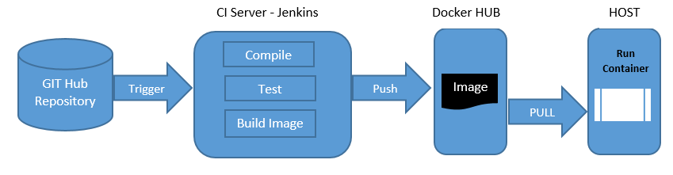

Git, Docker, automated testing, and continuous integration improve the productivity of a company by allowing development teams the ability to automate the development, testing, and integration of new code.

Git provides flexibility to developers by allowing them to track changes and work on separate (or even the same) bits of code synchronously. This gives potential for one team to branch code and work on a separate feature, completely isolated from another team that could be working somewhere else in the project team.

Docker allows developers to develop their code and commit changes inside an image, which will later be used by spinning up a container, allowing their code to run in an isolated and portable format. When developers push out a new major version of their code, users can pull in such changes and spin up new containers to replace the previous ones, giving a seamless experience by continuously integrating changes.

The automate testing, developers can leverage an continuous integration server, like Jenkins for example.  The job of this server would be to compile, test, and build an image of new code in an automated fashion. After passing automated testing, a new image could be pushed out to image registry, such as Docker Hub, where users can pull down the latest version of code. This strategy allows for speedy delivery of changes, making their product instantly more competitive than companies using the traditional, and more slow process of development.

